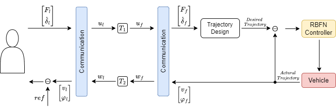

# A Neural Network Based Teleoperation for Autonomous Vehicles
This is the official project for The Project: A Neural Network Based Teleoperation for Autonomous Vehicles. 

## Paradigm

As illustrated in the figure, our approach consists of three core components: the Communication Module, the Trajectory Design Module, and the RBFN Controller. The Communication Module encodes human commands into wave variables on the leading operator side and decodes them back into command variables on the following AV side. The Trajectory Design Module uses these decoded command variables to generate the desired trajectory for the following AV. Finally, the RBFN Controller computes control signals based on the designed trajectory and the feedback of the actual trajectory from the following AV.
